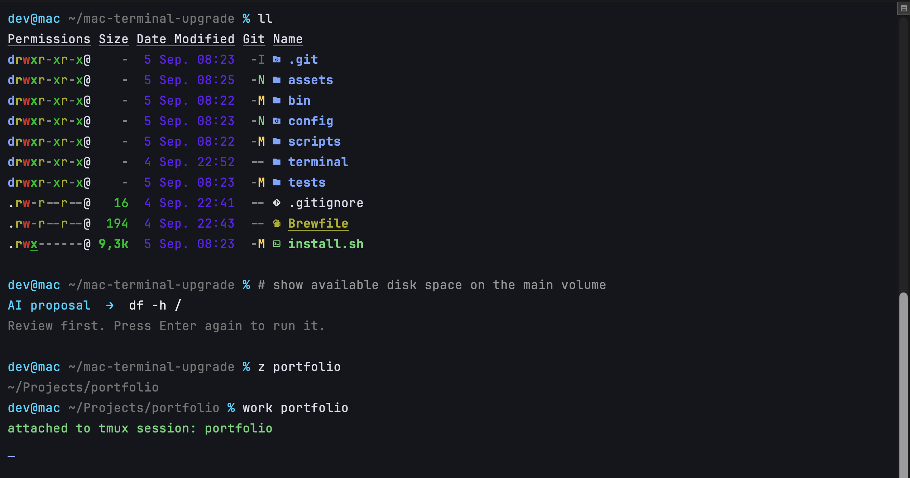

# mac-terminal-upgrade



<sub>Recorded in Terminal.app. The file listing and AI proposal were generated by tools included in this repository.</sub>

A reproducible upgrade for Apple Terminal. It keeps Terminal.app and Zsh, then adds a focused profile, modern command-line tools, persistent sessions, and reviewed inline AI commands.

## The problem it solves

| Friction | What changes |
| --- | --- |
| Dense monochrome listings | `ll` shows file types, permissions, icons, and Git state in color |
| Finding the right file interrupts the command | `Control-T` opens a fast file picker with a syntax-colored preview |
| Long commands are difficult to remember | Start with `#` and describe the result; AI proposes one command for review |
| Repeatedly typing project paths | `z project` learns the directories you visit |
| Losing work when a window closes | `work` returns to a persistent tmux session |
| Searching history and files manually | fzf adds interactive search and inline suggestions |

## Install

This is a private repository. With GitHub CLI authenticated:

```bash
gh repo clone bugroo/mac-terminal-upgrade ~/.mac-terminal-upgrade && ~/.mac-terminal-upgrade/install.sh
```

The installer creates a timestamped backup before changing anything. Open a new tab with `Command-T` after it finishes.

Preview every pending action without changing files, packages, or Terminal settings:

```bash
~/.mac-terminal-upgrade/install.sh --dry-run
```

## What it installs

- The `Mac-Terminal-Upgrade-Focus` Terminal profile and JetBrains Mono Nerd Font.
- `eza`, `fzf`, `fd`, `bat`, `zoxide`, syntax highlighting, and history suggestions.
- `navi` on `Control-G` and persistent tmux sessions through `work`.
- Codex CLI shortcuts: `ai`, `ai-web`, `ai-build`, and `ai-resume`.
- Inline AI command drafting: type `# describe the command`, then press `Enter`.

## Everyday commands

```bash
l             # compact list with icons
ll            # details, permissions, and Git state
lt            # two-level directory tree
bat README.md # syntax-colored file preview with line numbers
fd config     # fast file search that respects .gitignore
z project     # jump to a frequently used directory
work          # open or recover the main tmux session
ai            # open Codex with read-only access
ai-web        # read-only Codex session with web search
ai-build      # allow Codex to modify the current project
ai-resume     # resume the latest Codex session
```

### Pick files and directories without typing paths

- Press `Control-T` to select a file and insert its path. The right pane previews its contents with `bat`.
- Press `Control-/` inside the picker to hide or show the preview.
- Press `Option-C` to select a directory and move into it. The right pane previews its tree.

The picker skips `.git`, `node_modules`, and `target` while retaining hidden files elsewhere.

### Find large entries without remembering the command

```text
# show the 10 largest entries in this directory
→ du -ah . | sort -hr | head
```

The first `Enter` replaces the request with a proposed command. It does not execute automatically. Review it, then press `Enter` again.

### Move between projects and preserve the session

```bash
z portfolio
work portfolio
```

### Read a code directory at a glance

```bash
ll
# permissions · owner · size · date · icon · Git state
```

### Navigate command output like lightweight Warp blocks

Terminal.app automatically marks prompt lines. These native shortcuts make each command and its output easier to revisit:

- `Command-Up Arrow` / `Command-Down Arrow`: jump to the previous or next prompt.
- `Shift-Command-A`: select the output between marks.
- `Command-L`: clear back to the previous prompt mark.

These are navigable prompt regions, not full Warp blocks; Terminal.app does not provide Warp's block model.

## Inline AI safety model

The inline helper runs `codex exec` from an empty temporary directory. It does not attach shell history, previous output, or the contents of the current directory. Rules, plugins, apps, memories, and hooks are disabled, while the local Codex configuration is reused for ChatGPT authentication.

The Codex `read-only` sandbox blocks writes but can technically read files available to your macOS user; it is not operating-system isolation. Do not include secrets in inline requests.

Generated output must pass a local allowlist of inspection commands. Control characters, shell expansion, redirection, destructive `find` actions, executable Git options, and unapproved subcommands are rejected. The result is placed in the prompt for review and is never executed automatically.

If Codex is not authenticated:

```bash
codex login
```

## Diagnose and update

Run the read-only health check:

```bash
~/.mac-terminal-upgrade/doctor.zsh
```

Update the checkout with a fast-forward-only pull, create a fresh backup, and reapply the configuration:

```bash
~/.mac-terminal-upgrade/update.sh
```

The updater stops if the checkout contains local changes or is not on a branch. Preview the remote check and installer with `update.sh --dry-run`.

## Uninstall

```bash
~/.mac-terminal-upgrade/uninstall.sh
```

The uninstaller removes managed shell blocks, archives installed files, restores the previous default and startup Terminal profiles, and removes its dedicated profile. Homebrew packages remain installed because other applications may depend on them.

## Test without installing packages or changing Terminal.app

```bash
MTU_SKIP_PACKAGES=1 MTU_SKIP_TERMINAL=1 ./install.sh
```

Run the regression suite:

```bash
./tests/test-installer.zsh
```

## Compatibility

- macOS 14 Sonoma or newer.
- Apple Silicon is the primary target.
- Current Intel Macs are classified as Tier 3 by Homebrew.

## Official references

Implementation last checked against primary documentation on September 5, 2026:

- [Homebrew installation and supported prefixes](https://docs.brew.sh/Installation)
- [Apple Terminal profiles](https://support.apple.com/guide/terminal/trml107/mac)
- [fzf Zsh integration](https://github.com/junegunn/fzf#setting-up-shell-integration)
- [fzf file previews and fd integration](https://github.com/junegunn/fzf/blob/master/README.md)
- [bat syntax highlighting and previews](https://github.com/sharkdp/bat/blob/master/README.md)
- [fd search behavior](https://github.com/sharkdp/fd/blob/master/README.md)
- [zoxide Zsh integration](https://github.com/ajeetdsouza/zoxide#step-2-add-zoxide-to-your-shell)
- [eza colors and icons](https://github.com/eza-community/eza/blob/main/man/eza.1.md)
- [navi configuration](https://github.com/denisidoro/navi/blob/master/docs/configuration/README.md)
- [tmux sessions and configuration](https://github.com/tmux/tmux/wiki/Getting-Started)
- [Apple Terminal marks and bookmarks](https://support.apple.com/guide/terminal/trml135fbc26/mac)
- [Homebrew Bundle checks](https://github.com/Homebrew/brew/blob/main/docs/Brew-Bundle-and-Brewfile.md)
- [GitHub Actions runners](https://docs.github.com/en/actions/get-started/understand-github-actions)
- [Non-interactive `codex exec`](https://github.com/openai/codex/blob/main/codex-rs/README.md#codex-exec-to-run-codex-programmaticallynon-interactively)
