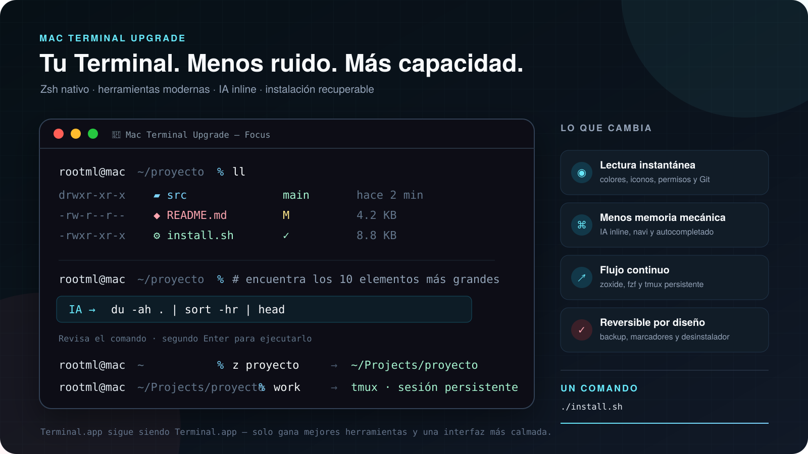

# mac-terminal-upgrade

Convierte Terminal.app de macOS en un entorno moderno, discreto y asistido por IA sin reemplazar Zsh ni copiar configuraciones privadas.



Compatibilidad objetivo: macOS 14 Sonoma o posterior en Apple Silicon. Homebrew clasifica los Mac Intel actuales como compatibilidad Tier 3.

## Instalación

El repositorio es privado. Con GitHub CLI autenticado:

```bash
gh repo clone bugroo/mac-terminal-upgrade ~/.mac-terminal-upgrade && ~/.mac-terminal-upgrade/install.sh
```

El instalador crea un backup antes de tocar nada. Después, abre una pestaña nueva con `⌘T`.

## Qué instala

- Perfil exclusivo `Mac Terminal Upgrade - Focus` para Terminal.app y JetBrains Mono Nerd Font.
- `eza`, `fzf`, `zoxide`, resaltado de sintaxis y sugerencias de historial.
- `navi` con `Ctrl+G` y `tmux` mediante el comando `work`.
- Codex CLI y accesos seguros: `ai`, `ai-web`, `ai-build` y `ai-resume`.
- IA inline: escribe `# describe el comando` y pulsa `Enter`.

## Uso rápido

```text
# muestra los 10 archivos más grandes de esta carpeta
```

El primer `Enter` sustituye la petición por un comando. El comando no se ejecuta automáticamente: revísalo y pulsa `Enter` otra vez.

### Problemas que resuelve

| Antes | Ahora |
| --- | --- |
| Listados monocromos difíciles de recorrer | `ll` muestra iconos, tipos, permisos y estado Git con color |
| Recordar comandos largos | Escribes una intención con `# …` y la IA propone el comando |
| Repetir rutas completas | `z proyecto` aprende los directorios que visitas |
| Perder el trabajo al cerrar una ventana | `work` recupera una sesión persistente de tmux |
| Buscar manualmente en historial y archivos | fzf añade búsqueda interactiva y sugerencias mientras escribes |

### Ejemplos reales

Encontrar los elementos grandes sin memorizar la sintaxis:

```text
# muestra los 10 elementos más grandes de esta carpeta
→ du -ah . | sort -hr | head
```

Entrar en un proyecto frecuente y conservar la sesión:

```bash
z portfolio
work portfolio
```

Entender el estado de una carpeta de código de un vistazo:

```bash
ll
# permisos · propietario · tamaño · fecha · icono · estado Git
```

Comandos adicionales:

```bash
l             # listado compacto con iconos
ll            # detalles, permisos y estado Git
lt            # árbol de dos niveles
z proyecto    # navegación por frecuencia
work          # sesión tmux persistente
ai            # Codex en modo lectura
ai-build      # Codex puede modificar el proyecto actual
```

## Privacidad y seguridad

La IA inline ejecuta `codex exec` desde un directorio temporal vacío. No adjunta el historial, la salida anterior ni el contenido de la carpeta actual. Desactiva reglas, plugins, apps, memoria y hooks, pero reutiliza la configuración local de Codex para poder usar tu sesión de ChatGPT.

El sandbox `read-only` de Codex impide escrituras, pero técnicamente permite leer archivos accesibles a tu usuario: no es aislamiento del sistema operativo. No escribas secretos en la petición inline. La respuesta pasa por una lista local de comandos de consulta permitidos y siempre queda en el prompt, sin ejecutarse automáticamente. Revísala antes del segundo `Enter`.

Las credenciales no forman parte del repositorio. Si Codex todavía no está autenticado, ejecuta:

```bash
codex login
```

## Desinstalación

```bash
~/.mac-terminal-upgrade/uninstall.sh
```

La desinstalación elimina los bloques administrados, mueve los archivos instalados al backup, restaura los perfiles predeterminado y de inicio anteriores y retira su perfil exclusivo. No desinstala paquetes de Homebrew porque otros programas podrían utilizarlos.

## Opciones de prueba

```bash
MTU_SKIP_PACKAGES=1 MTU_SKIP_TERMINAL=1 ./install.sh
```

Estas variables están destinadas a pruebas y a instalaciones parciales controladas.

## Fuentes oficiales verificadas

La implementación se contrastó el 4 de septiembre de 2026 con documentación oficial y fuentes primarias. Antes de cambiar versiones o comandos, deben volver a consultarse estas fuentes:

Base del sistema:

- [Instalación y prefijos oficiales de Homebrew](https://docs.brew.sh/Installation)
- [Perfiles de Terminal.app — Apple](https://support.apple.com/guide/terminal/trml107/mac)

Herramientas del shell:

- [Integración Zsh de fzf](https://github.com/junegunn/fzf#setting-up-shell-integration)
- [Configuración Zsh de zoxide](https://github.com/ajeetdsouza/zoxide#step-2-add-zoxide-to-your-shell)
- [Opciones de color e iconos de eza](https://github.com/eza-community/eza/blob/main/man/eza.1.md)
- [Configuración oficial de Navi](https://github.com/denisidoro/navi/blob/master/docs/configuration/README.md)
- [Configuración y sesiones de tmux](https://github.com/tmux/tmux/wiki/Getting-Started)

IA:

- [`codex exec` no interactivo](https://github.com/openai/codex/blob/main/codex-rs/README.md#codex-exec-to-run-codex-programmaticallynon-interactively)
